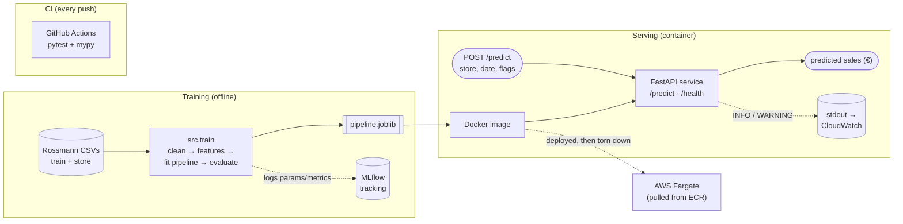

# store-sales-service

[](https://github.com/serkanshentyurk/store-sales-service/actions/workflows/ci.yml)

A containerised machine-learning service that predicts daily sales for retail
stores and serves those predictions over a REST API. The model is trained
offline and shipped inside a Docker image, so a running container answers
prediction requests without any training step.

## Problem

Given a store and a date (plus whether a promotion is running and the
holiday context), predict that store's sales for the day. The intended
consumer is short-horizon operational planning — inventory and staffing —
where a per-store, per-day sales estimate is more useful than an aggregate
forecast.

The data is the [Rossmann Store Sales](https://www.kaggle.com/c/rossmann-store-sales)
dataset: ~1.0M daily records across 1,115 stores (Jan 2013 – Jul 2015),
joined to per-store metadata.

## Results

Evaluated on a temporal holdout — the last 6 weeks of data, held out entirely
from training — against a strong per-store baseline.

| Model                                    | RMSPE  | MAE (€) |
| ---------------------------------------- | ------ | -------- |
| Baseline (per-store × day-of-week mean) | 0.2332 | 1240.3   |
| HistGradientBoostingRegressor            | 0.1760 | 806.3    |

RMSPE is the competition's metric; MAE is reported in euros for a
decision-legible number. On a mean daily sale of ~€5,800, an MAE of ~€806 is
roughly a 14% average error per store-day, and the model reduces RMSPE by
~25% over the baseline.

The baseline is not a throwaway: a per-store × day-of-week mean already
captures each store's typical level, and the model has to beat it to justify
its existence. It does — but that comparison is the point, not the headline
number alone.

## How to run

The model is trained separately from the service. A fresh clone must obtain
the data and train once before building the image.

```bash
# 1. Data: download train.csv and store.csv from the Kaggle competition
#    and place them in data/
#    (the dataset is not committed to this repository)

# 2. Train — produces models/pipeline.joblib
python -m src.train

# 3. Build the image
docker build -t store-sales-service .

# 4. Run the service
docker run --rm -p 8000:8000 store-sales-service
```

The service is then available at `http://localhost:8000`:

- `GET  /health`  — liveness check, returns `{"status": "ok"}`
- `POST /predict` — returns a predicted sales figure
- `GET  /docs`    — interactive API documentation (auto-generated)

Example request:

```bash
curl -X POST http://localhost:8000/predict \
  -H "Content-Type: application/json" \
  -d '{"Store": 1, "Date": "2015-08-05", "Promo": 1,
       "StateHoliday": "0", "SchoolHoliday": 0}'
# -> {"predicted_sales": 4823.5}
```

## Architecture



The training path (left) produces a fitted pipeline that is baked into the
Docker image; the serving path (right) loads that artefact once and answers
prediction requests. CI checks every push, and the same image was deployed to
AWS Fargate as a one-off validation (now torn down — see
[Deployment](#deployment)).

## How it works

A prediction request flows through the service as follows:

1. **Validation.** The incoming JSON is validated against a Pydantic schema.
   Malformed requests (missing fields, wrong types) are rejected with a 422
   before any model code runs.
2. **Enrichment.** The request carries only what a caller would realistically
   know — store id, date, promo and holiday flags. Static store metadata
   (store type, assortment, competition distance, Promo2) is looked up from a
   reference table by store id. An unknown store id is rejected with a 400.
3. **Feature engineering.** Calendar features are derived from the date, and a
   months-since-competition-opened feature is computed. This step is shared
   between training and serving so the two cannot diverge.
4. **Model.** A single scikit-learn `Pipeline` (a `ColumnTransformer` feeding a
   `HistGradientBoostingRegressor`) produces the prediction. The target is
   modelled on a log scale and inverted, so the output is already in euros.

The model artefact is loaded once per process and cached, so repeated requests
do not re-read it from disk.

## Design decisions

- **Baseline first.** A per-store × day-of-week mean is computed and must be
  beaten before the model is considered worthwhile. A simpler model that wins
  is a result, not a failure.
- **Temporal holdout, not random cross-validation.** The data is time-ordered
  and the model is used to predict forward, so evaluation holds out the most
  recent 6 weeks. A random split would leak future information into the past
  and flatter the metric.
- **Target encoding for `Store`.** With 1,115 stores, one-hot encoding is
  impractical and the per-store sales level is the dominant signal. `Store` is
  target-encoded with internal cross-fitting to avoid leaking the target into
  its own feature.
- **Log-target regression.** Sales are right-skewed; the target is modelled as
  `log1p(Sales)` and inverted with `expm1`, with all reported metrics in the
  original euro units.
- **Structural nulls treated as "not applicable," not "missing."** Stores
  without a Promo2 schedule or a competition-open date have null metadata
  *because the thing does not apply*, so those are not imputed as if data were
  missing.
- **No probability calibration.** Calibration is a classification concept; this
  is a regression task, so it does not apply.
- **Training and serving are separate.** The image ships a pre-trained
  artefact rather than training at build time, keeping the build fast and the
  large training file out of the image.

## Testing

```bash
python -m pytest
```

14 tests covering:

- **Data cleaning** — closed and zero-sales rows are dropped, store metadata
  joins correctly, `StateHoliday` is not silently parsed as numeric.
- **Feature engineering** — calendar features are derived correctly and
  not-applicable competition dates are preserved as null (not fabricated).
- **A contract test** — the feature output fits the preprocessor and produces a
  finite matrix, so a feature/transformer mismatch fails in tests rather than
  in production.
- **API integration** — `/health`, a successful prediction (200), an unknown
  store (400), and a bad-typed field (422), exercised through the real API
  with the model loaders replaced by tiny in-memory stand-ins so the suite runs
  without the trained artefact or the dataset present.

The source is type-checked with `mypy`. Both the test suite and the type check
run automatically in CI (GitHub Actions) on every push, on a clean machine —
which also verifies that the tests genuinely need no local data or model.

## Experiment tracking

Training runs are tracked with [MLflow](https://mlflow.org/). Each run logs its
parameters (holdout window, random seed, model type) and metrics (model and
baseline RMSPE/MAE), so configurations can be compared in the MLflow UI rather
than by reading terminal output. The tracking store is a local SQLite backend
(MLflow 3's default).

This is experiment tracking only — the model registry is deliberately not used.
The trained artefact is saved with `joblib` and copied into the Docker image as
described above; it is not pulled from a registry at build time.

## Logging

The service logs through Python's `logging` module: an INFO line per served
prediction and a WARNING line when a request is rejected (unknown store).
Logging is configured once at the application entry point and written to
stdout/stderr, so a running container's logs are captured by Docker (and, later,
by a cloud log collector) with no additional configuration.

## Deployment

The container has been deployed to AWS as a validation of the production path:
the image pushed to Amazon ECR, run as an AWS Fargate task under an IAM
execution role, with logs flowing to CloudWatch and the API reachable over the
public internet. This was done as a one-off exercise and the resources have been
torn down, so there is no live endpoint — but the deploy path
(ECR → Fargate → IAM role → CloudWatch) has been exercised end to end, not just
described.

## Limitations

- **The holdout is a single quiet window.** The last 6 weeks (mid-June to
  end-July 2015) contain no Christmas or back-to-school peak, so the reported
  RMSPE reflects a calm period and is not a year-round or peak-season estimate.
- **Unknown stores are rejected, not cold-started.** A store id absent from the
  reference table returns a 400 rather than falling back to a global-average
  prediction.
- **No trend extrapolation.** The gradient-boosted model cannot extrapolate the
  year-on-year sales trend beyond the range seen in training; predictions for
  dates far past the training window will not track continued growth.
- **The shipped model is whatever was last trained locally.** There is no
  record inside the image of which data or code version produced the artefact.
  Making that traceable is planned (see below).
- **Deliberately limited feature engineering.** No lag features and only
  minimal promo-calendar logic, to keep the model the smaller part of the
  project and the production path the focus.

## Requirements

- Python 3.12
- Runtime dependencies in `requirements.txt`; development/test dependencies in
  `requirements-dev.txt`.

## Planned (not yet implemented)

The following are on the roadmap and are **not** part of the current repository:
a persistent/automated cloud deployment (the deploy described above was a
manual, torn-down exercise), basic drift monitoring, and the MLflow model
registry (as opposed to the experiment tracking already in place).
